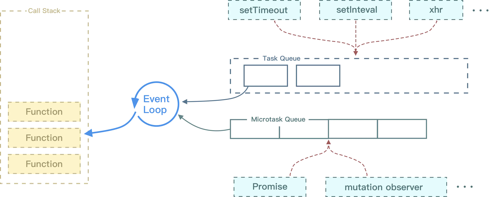
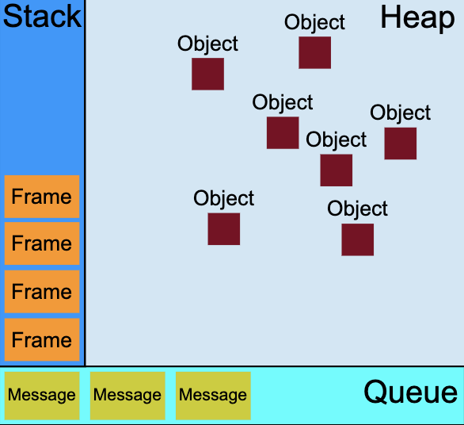

# 异步编程

要了解的点：

- 同步模式和异步模式的差异
- 事件循环与消息队列
- 异步编程的几种方式
- Promise异步方案、宏任务/微任务队列
- Generator异步方案、Async/Await语法糖

## 执行栈、堆、队列、事件循环、js单线程、宿主

### js单线程是指js的引擎线程

- 在浏览器环境中有js引擎线程和渲染线程，且两个线程互斥；node环境中只有js线程

### 宿主

- js的运行环境。一般为浏览器或者Node

### 执行栈

- ：当开始执行js代码时，会先执行一个anonymous函数，然后根据先进后出的原则，后执行的函数会先弹出栈

### 事件循环（EventLoop）

> Js引擎常驻于内存中，等待宿主将js代码或函数传递给它，也就是等待宿主环境分配宏观任务，反复等待-执行即为事件循环

Event Loop中每一次循环成为tick，每一次tick任务如下：



- 执行栈接收最先进入队列的宏任务（一般成为tick），执行其同步代码直至结束；
- 检查是否存在微任务，有则会执行至微任务队列为空
- 如果宿主为浏览器可能会渲染页面
- 开始下一轮tick，执行宏任务中的异步代码（setTimeout等回调）

### 宏任务和微任务

> es6规范中，microtask称为jobs，macrotask称为task，宏任务是由宿主发起的，微任务是由JavaScript自身发起的

### 参考

- [栈（Stack）、堆（Heap）、队列（Queue）、事件循环](!https://developer.mozilla.org/zh-CN/docs/Web/JavaScript/EventLoop)




## 同步模式--排队执行

单线程工作模式：负责执行代码的线程只有一个

优点：更安全更简单

缺点：耗时任务阻塞执行,出现假死的情况

表示代码中的任务依次执行，后一个任务必须等待前一个任务结束开始执行，排队执行

调用栈：正在执行的工作表，记录正在做的事情

## 异步模式--

不会等待这个任务的结束才会进行下一个任务，开启过后立即往后执行下一个任务

作用：让单线程的JavaScript语言同时处理大量的耗时任务

倒计时器：单独工作不会受js线程影响

消息队列：待办的工作表

EventLoop：负责监听调用栈和消息队列，一旦调用栈中所有的任务都已经结束，消息队列就会取出第一个回调函数压入调用栈

js执行引擎：就是先去做完调用栈中所有的任务，然后再通过事件循环从消息队列中取一个任务再去执行，以此类推。过程中还可以往消息队列中添加任务，进行排队等待事件循环。

各个环节没有执行顺序

JavaScript是单线程的，但是浏览器不是单线程的，JavaScript调用的内部的API并不是单线程的

异步模式是指运行环境提供的API是以异步模式去工作，异步模式是下达这个任务的开始指令就会往下执行，代码不会在这一行等待结束，例如：setimeout

## 回调函数-所有异步编程方案的根基

回调函数：由调用者定义，交给执行者执行的函数

CommonJs社区提出了Promise的规范，在ES2015中被标准化，成为语言规范

promise：承诺状态明确了之后都会有相应的任务会被自动执行，一旦明确了结果之后就不可能会发生改变了

### 基本用法

webpack-dev-server 配合
html-webpack-plugin自动生成使用当前js的HTML文件，而且会有自动刷新

```js
yarn webpack-dev-server 04-promise-simple.js --open

--open自动打开浏览器
```
即便promise中没有任务的异步操作，then方法仍然会进入异步队列中排队，要等待同步代码全部执行完成后才会执行

promise最大的优势就是可以进行链式调用

### promise的特点

- promise对象的then方法会返回一个全新的promise对象
- 后面的then方法就是在上一个then返回的Peomise注册回调
- 前面then方法中回调函数的返回值会作为后面then方法回调的参数
- 如果回调中返回的是Promise，那后面then方法的回调会等待他的结束
- 如果回调中没有返回任何值，默认返回的是undefined

### promise catch

在代码中明确捕获每一个错误，而不是在全局统一处理

### promise 静态方法

- promise.resolve()快速的把一个值转为onFullfilled的promise对象,如果传入的是一个字符串，则它的onFullfilled拿到的参数就是字符串

  ```js
    Promise.resolve('foo').then((value)=>{
    console.log(value)
    })
    //完全等价于
    new Promise((resolve,reject)=>{
        resolve('foo')
    }).then((value)=>{
        console.log(value)
    })
  ```

- 如果promise.resolve()里面是另一个promise对象那这个对象会被原样返回
  
  ```js
  var promise = ajax('/api/users.json')
  var promise2 = Promise.resolve(promise)
  console.log(promise===promise2)
  ```

- 如果promise.resolve()传入的是一个包含then方法的对象,也就是说这个then中可以接收onFullfilled和onRejected两个回调，调用onFullfilled然后传入一个值，这样也可以作为一个promise被执行，那有这种then方法的对象是实现了一个叫做thenable的接口，也就是说这是一个可以被then的对象

> 接收这种对象的原因是,原生promise还没有被普及之前，很多时候都是使用第三方库去实现的promise，那把第三方的promise转为原生的promise就可以使用这种机制
  
  ```js
    Promise.resolve({
        then:(onFullfilled,onRejected)=>{
            onFullfilled('foo')
        }
    })
    .then((value)=>{
        console.log(value)
    })
  ```

- Promise.reject()只有一种失败的情况

```js
//不论传入什么值被捕获的都是一个失败的原因
Promise.reject(new Error('iii')).then((value)=>{
   console.log(value)
}).catch((error)=>{
    console.log(error)
})
```

### promise 并行

- Promise.all()可以将多个promise合并为一个promise统一管理，他需要接收的是一个数组，而这个数组中的每一个元素都是一个promise对象,Promise.all()返回一个全新的promise对象，内部所有的Promise完成过后这个全新的Promise才会完成，那这个promise拿到的结果会是一个数组，里面包含着每一个异步任务执行的结果，要注意的是这两个promise都成功结束，这个全新的promise才会成功结束，如果其中一个有失败,那这个任务就会以失败结束

```js
var promise = Promise.all([
    ajax('/api/users.json'),
    ajax('/api/posts.json')
])
promise.then((values)=>{
    console.log(values)
}).catch((error)=>{
    console.log(error)
})
```

```js
//组合使用串行和并行这两种方式
//先使用ajax获取到所有的请求地址
ajax('/api/urls.json')
.then((value)=>{
    const urls = Object.values(value)
    const tasks = urls.map((item)=>ajax(item))
    Promise.all(tasks)
    .then((values)=>{
        console.log(values)
    })
    .catch((error)=>{
        console.log(error)
    })
})
```

- Promise.race()与Promise.all()不同的是只会等待第一个结束的任务，而后者是等待所有的任务成功结束

```js
//promise.race()
const request = ajax('/api/posts.json')
const timeout = new Promise((resolve,reject)=>{
    setTimeout(() => {
        reject(new Error('timeout'))
    }, 500);
})
Promise.race([
    request,
    timeout
]).then((values)=>{
    console.log(values,'race')
}).catch((error)=>{
    console.log(error,'race')
})
//浏览器 Network-Slow 3G选择一个相对慢一些的网速，是实现日常ajax请求超时控制的一种方式
```

### promise执行顺序/ 宏任务VS.微任务

回调队列中的任务称之为[宏任务]，宏任务执行过程中可以临时加上一些额外的需求，可以选择作为一个新的宏任务进行队列中排队，也可以作为当前任务的微任务
微任务就是直接在当前任务结束后立即执行，而不是到整个任务的末尾进行排队。
promise的回调会作为微任务执行，所以是在本来任务的执行末尾再去执行
settimeout是以宏任务的形式进入到回调队列的末尾
微任务是为了提高任务的响应能力
目前大多数异步调用都是作为宏任务执行，Promise和MutationObserver对象，还有node中的process.nextTick是作为微任务

### Generator异步方案

生成器函数

```js
//generator
function* foo() {
    console.log('start')
    //函数内部可以使用yield关键词往外返回一个值
    /*yield执行器并不表示函数已经全部执行完了，并不会跟return一样立即结束当前函数，它只是暂停生成器函数的执行
    直到外部再次使用next，当前函数才会继续往下执行
    */
   try{
    const res = yield 'foo'
    console.log(res)
   } catch(e){
       console.log(e)
   }

}
//当我们调用这个generator函数并没有立即执行，而是得到一个生成器对象
const generator = foo()
//而是手动调用这个函数的.next，这个函数的函数体才会开始执行
//可以在next返回对象中拿到函数中yield返回的值
const result = generator.next()

/*
{one: false;value: "foo"}
返回对象中有一个done属性，去表示这个生成器是否全部执行完成
*/
console.log(result)

//调用next传入参数时，那传入的参数就是会作为yield这个执行语句的返回值
generator.next('bars')

//是对生成器内部抛出一个异常,生成器内部可以通过trycatch去捕获这个异常
generator.throw(new Error('Generator error'))
```

### async await

```js
/*
async 是语言层面的标准过程语法，可以给我们返回一个promise对象,
比较有利于我们对整体代码进行控制

await关键词只能出现在async函数中，不能直接在外部使用
*/
async function main() {
    try {
        const user = await ajax('/api/users.json')
        console.log(user)
        const posts = await ajax('/api/posts.json')
        console.log(posts)
    } catch (e) {
        console.log(e)
    }
}

const promise = main()
promise.then(()=>{
    console.log("all completed")
})
```

### 课堂练习的考点

- Promise.resolve(1).then(2).then(console.log(Promise.resolve(3))).then(console.log)

- 异步编程的基础定义，常用函数等

### 参考文档

