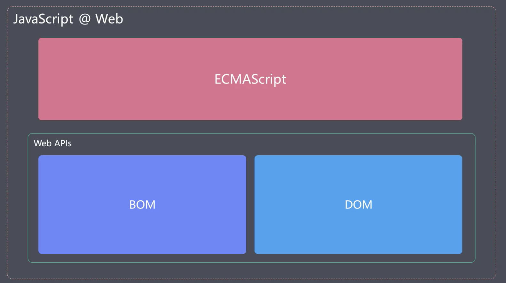
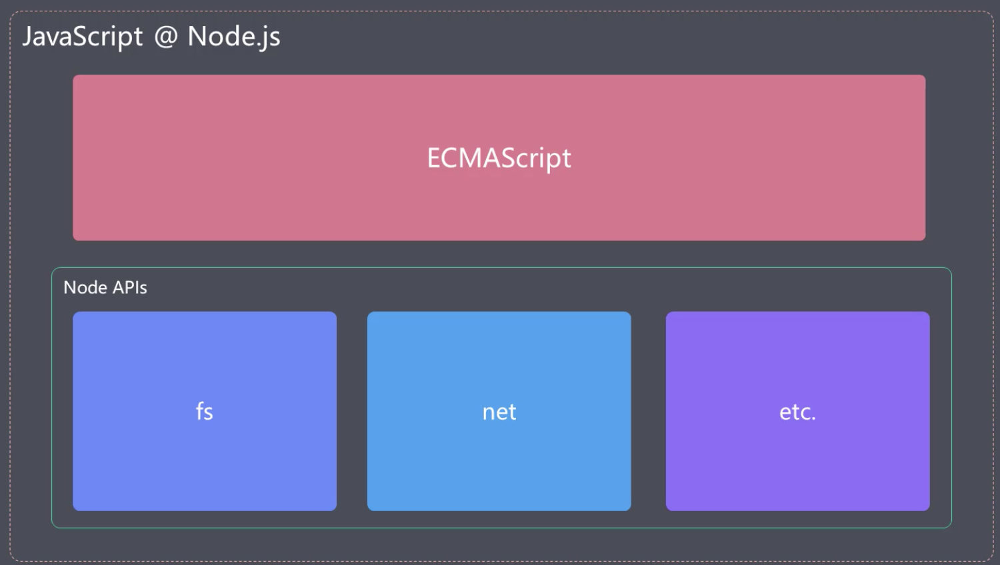

# ECMaScript新特性

为什么要学习ECMAScropt

> - 很多开发者并没有理解语言和平台之间的关系
> - 对Es的理解和掌握程度都不尽相同，系统化的学习ECMAScript很有必要

## 概要

- ECMAScript与javascript
- ECMAScript的发展过程
- ECMAScript2015新特性
- more...

## ECMAScript与javascript

ECMAScript也是一门脚本语言，一般缩写为es，通常看做JavaScript的标准化规范，实际上JavaScript是ECMAScript的扩展语言，ECMAScript中只是提供了最基本的语法（就是约定了代码该如何编写，定义函数），只是停留在语言层面，并不能完成我们应用的实际功能开发

javascript实现了ECMAScript的语言标准并在这基础之上做了扩展，使得我们可以在浏览器中操作Dom和Bom，在node中可以做读写文件之类的一些操作

### 在浏览器中



### 在node环境中



所以JavaScript语言本身指的是ECMAScript

## ECMAScript的发展过程

从2015年开始每年发布一个版本，所以开始以年份命名
很多人把ES称之为ES6

## ECMAScript2015（ES6）新特性

是新版本Es的代表版本

- 相比于ES5.1变化比较大
- 自此，标准命名规则发生变化
- 要注意分辨资料中的ES6是特指ES2015还是泛指ES2015及以后的所有新标准

[ES2015完整规格文件](http://www.ecma-international.org/ecma-262/6.0)

### 四大类新特性

- 解决原有语法上的一些问题或者不足
- 对原有语法进行增强
- 全新的对象、全新的方法、全新的功能
- 全新的数据类型和数据结构

#### 准备工作

使用Nodemon的作用是修改完代码后自动执行代码

```js
yarn nodemon 文件名称
```

#### let与块级作用域

作用域 - 某个成员能够起作用的范围

ES2015之前es只有两种作用域：

- 全局作用域
- 函数作用域

ES2015中新增

- let块级作用域

块 就是用"{}"包裹起来的范围

例如：

```js
if(true){
    console.log('fad')
}

for(var i =0 ; i<10;i++>){
    console.log('fad')
}
中的"{}"会产生块
```

因为之前没有块的概念，我们在{}外可以访问到内部的变量
例如：

```js
if(true){
    var foo = 'fad'
}
console.log(foo)
//fad
```

#### const 衡量和常量

声明后不能再修改

```js
/*
const声明过后不能修改
也就是声明的时候必须设置一个初始值，声明和赋值不能和var一样放到两个语句当中
// */
const name = 'qwe'
name = 'ert'
//TypeError: Assignment to constant variable.


/*
const声明的成员不能被修改，只是说我们在声明后不能去指向一个新的内存地址，并不是
不能修改常量中的属性成员
*/
const obj={}
obj.name='qwe'
//这样是被允许的
obj = { 'a': 1 }
//这样是不被允许的
```

>最佳实践建议：不用var，主用const，配合let。默认使用const的原因是更明确我们声明的这些元素会不会被修改。

#### 数组解构

```js
//数组的解构

const arr = [100, 300, 600]

//之前是通过索引去获取相应的值
const foo = arr[0]
const bar = arr[1]
const baz = arr[2]
console.log(foo, bar, baz)

/*
现在可以通过结构的方式快速拿到相应的值
可以根据我们定义变量的位置去分配变量的值
*/
const [foo,bar,baz]=arr
console.log(foo,bar,baz)

/*
只获取某个位置的成员，其他位置需要保留相应的”，“
*/
const [,,baz]=arr
console.log(baz)

/*
...表示从当前位置开始往后所有的成员，这里只能放到最后使用,且返回的是个数组
*/
const [foo, ...rest] = arr
console.log(rest)

/*
如果结构成员的个数小于被解构数组的长度，那就会按照从前到后的顺序去提取
*/

const [foo] = arr
console.log(rest)

/*
如果结构成员的个数大于被解构数组的长度，那提取出来就是undefined，与数组中访问不存在的下标是一样的
*/
const [foo, bar, baz, opp] = arr
console.log(opp)

/*
给提取到的成员设置默认值
*/
const [foo, bar, baz = 100, opp = 900] = arr
console.log(opp)

/*
举例
*/
const path = '/foo/bar/baz'
// const tmp = path.split('/')
// const rootdir = tmp[1]

const[,rootdir]= path.split('/')
console.log(rootdir)
```

#### 对象的结构

```js
//对象解构
/*
根据属性名提取
*/
const obj = { name: 'qwe', age: 18 }
const { name, age } = obj
console.log(name)

/*
重命名的方式,并设置默认值的方式
*/
const { name: ObjName = 'asd' } = obj
console.log(ObjName)

/*
简化代码编写，减小代码体积
*/
const { log } = console
log(1)
log(2)
log(4)
log(5)
```

#### 模板字符串字面量

```js
//增强了模板字符串字面量
/*
支持换行符和多行文本
*/

const atr = `hello es2015,

this is a '\string\'`

/*
${}是标准的JavaScript，也就是可以包含运算
*/
const name = 'tom'
const msg = `Hi,${name}`

```

##### 模板字符串函数

```js

// const str = console.log`hello World`
// [ 'hello World' ]
const name = 'tom'
const gender = true
function myTag(str,name,gender) {
    // console.log(str)
    // console.log(name)
    // console.log(gender)
    /*
    1、返回模板字符串内容分割后的结果，是按照表达式分割过后那些静态的内容
    所以是个数组

    2、还可以接收所有出现在我们模板字符串中表达式的返回值

    3、这个函数的返回值就是带标签的模板所对应的返回值

    4、作用就是对我们的字符串进行加工,文本的多语言化，内容翻译，模板引擎
    */
   return 123//123
    //[ 'Hey,', ' is a ', '' ]
}
const result = myTag`Hey,${name} is a ${gender}`
console.log(result)
```

#### 字符串的扩展方法

- includes()
- startsWidth()
- endsWith()

```js
//字符串的扩展方法

const message = 'error：foo is not defined'

console.log(message.includes('d'))//是否包含
console.log(message.startsWith('err'))//是否以err开始
console.log(message.endsWith('ed'))//是否以ed结束
```

#### 参数默认值

```js
//参数默认值
// function foo(enable) {
//     // 短路运算的方式，如果传入false会发生错误
//     enable = enable || true
//     // es6之前设置默认值
//     enable = enable == undefined ? true : enable
//     console.log(enable)
// }

// es6设置默认值
//如果有多个参数的情况，我们的默认值参数要放到最后
function foo(qwe, bar = 123, enable = true) {
    console.log(enable)
    console.log(bar)
    console.log(qwe)
}
foo(345)
```

#### 剩余参数

```js
/*
只能出现在参数最后一位，而且只能是用一次
*/
function foo(first,...rest){
    // arguments是伪数组
    console.log(arguments)
    console.log(rest)
}
foo(1,2,3)
//[Arguments] { '0': 1, '1': 2, '2': 3 }
//[ 2, 3 ]
```

#### 展开数据

```js
//数组展开 spread

const arr = ['foo','bar','baz']

//之前展开数组
console.log(arr[0],arr[1],arr[2])
//不确定数组长度
console.log.apply(console,arr)
console.log(...arr)
```

#### 箭头函数

```js
//箭头函数

// 传统方式
function inc(n) {
    return n + 1
}
//箭头函数

/*
有多条语句时
使用{}时需要手动return

极大的简化了回调函数的编写
*/
const inc = (n, b) => n + 1
const inc = (n, b) => {
    return n + 1
}
console.log(inc(1))

// 刷选奇数
const arr = [1, 2, 3, 4, 5, 6, 7, 8]
arr.filter(function (item) {
    return item % 2
})
arr.filter(item => item % 2)
```

#### 箭头函数与this

```js
//箭头函数与this
/*
箭头函数不会改变this的指向√
*/
const person = {
    name: 'tom',
    // 普通函数中，this始终指向调用这个函数的对象
    sayHi: function () {
        
        console.log(this)
        console.log(`hi,my name is ${this.name}`)
    }
    //hi,my name is tom

    // 在箭头函数中，箭头函数外面this是什么，箭头函数里面this就是什么
    sayHi: () => {
        console.log(this)
        console.log(`hi,my name is ${this.name}`)
    },
    //hi,my name is undefined

    sayHiAsync: function () {
        /* 
        setTimeout里的函数是放在全局对象上被调用，所以里面function拿不到当前作用域对象里面的this
        一般会定义一个_this去保存当前作用域的this
        借助于闭包的机制去在内部使用this
        */
        const _this = this
        setTimeout(function () {
            console.log(_this.name,'sayHiAsync')
        }, 1000)

        // 如果使用箭头函数,因为里面的this始终是当前作用域里面的this,也就是指向person
        setTimeout(()=>console.log(this.name,'arrow this'))
    }
}
person.sayHi()
// let person2Say = person.sayHi
// person2Say()
//hi,my name is undefined

person.sayHiAsync()
```

#### 对象字面量的增强

- 1.如果变量名与属性名一致，就可省略掉”：“及以后面的变量名
- 2.如果要给对象添加一个方法,可以省略掉”: function“
- 3.可以使用表达式的返回值最为对象的属性名,这种特性称为【计算属性名】

```js
//对象字面量

/*es2015之前*/
const bar = '234'
const obj = {
    foo: '123', bar: bar, baz: '345',
    methods: function () {
    },
}
//动态添加属性
obj[Math.random()] = '789'

/*
es2015之后
*/
const obj = {
    foo: '123', bar, baz: '345',
    // 需要注意的是这种是普通的funciton方法，里面的this指向当前对象
    methods() {
        console.log(this)
    },
    // 【计算属性名】
    [Math.random()]: '789'
}

console.log(obj)
obj.methods()
```

#### 对象扩展方法

##### Object.assign

```js
//对象扩展方法
/*
Object.assign 可以将多个源对象中的属性复制到一个目标对象中，如果有相同属性源对象中的属性就会覆盖掉目标对象中的属性
*/

const source1 = {
    a: 123,
    b: 345
}
const source2 = {
    b: 345,
    d: 298,
}
const target = {
    a: 567,
    c: 897
}
/* 
用后面对象的属性去覆盖第一个对象,且返回值为第一个对象

如果传递了2个以上的对象，就是除第一个外的对象复制到第一个对象中
*/
const result = Object.assign(target, source1, source2)
console.log(target)
console.log(target === result)

// 我们常用来复制一个对象

function func(obj) {
    // 如果我们在函数内部改变了函数的属性，那外部的对象也会发生变化，因为他们指向同一个内存地址

    // obj.name = 'func obj'
    // console.log(obj)

    //如果只是想在函数内部改变这个对象的属性，可以使用Object.assign方法把他们复制到一个全新的对象中
    const funcObg = Object.assign({}, obj)
    funcObg.name = 'func obj'
    console.log(funcObg,'funcObg')
}

const obj = { name: 'global obj' }
func(obj)
console.log(obj,'obj')
```

##### Object.is

```js
//Object.is 来判断两个值是否相等

//==会在比较前自动转换数据类型
console.log(
    0 == false
)
//===严格比较，数字0的正负没办法区分，NaN===NAN不相等
console.log(
    0 === false
)
console.log(
    NaN === NaN
)
```

#### Proxy

```js
//proxy 监视某个对象的读写过程

/*
我们可以使用Object.defineProperty监视某个对象的读写,来为对象添加属性，这样就可以捕获到对象的读写过程
vue3.0之前就是使用这种方法来实现的数据响应,而完成双向数据绑定
*/

const person = {
    name: 'zce',
    age: 20
}

//创建代理对象 第一个参数是要代理的对象
const personProxy = new Proxy(person, {
    get(target, property) {
        console.log(target, property)
        return property in target ? target[property] : 'default'
        //get的返回值是外部访问这个属性得到的结果
    },//监视对象的访问,target为目标对象,property为访问的属性名
    set(target, property, value) {
        console.log(target, property, value, 'set')
        if(property==='age'){
            if(!Number.isInteger(value)){
                throw new TypeError(`${value} is not an int`)
            }
        }
        target[property] = value
    }//监视对象设置属性的过程,三个参数target为目标对象,property为访问的属性名，value为属性值
})

console.log(personProxy.name)
console.log(personProxy.xxx)
// 通过personProxy代理对象给person写入gender属性
personProxy.gender = true
personProxy.age = 'ert'
```

defineProperty只能监视属性的读写，Proxy能够见识到更多对象操作