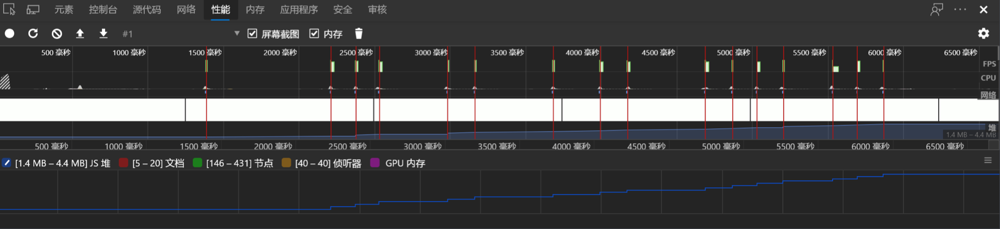
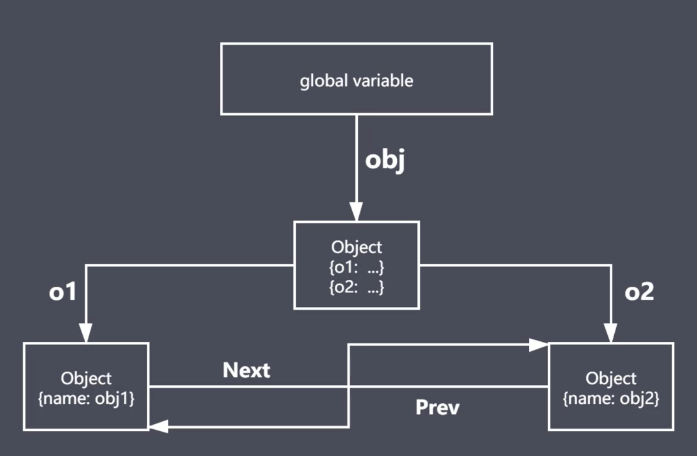
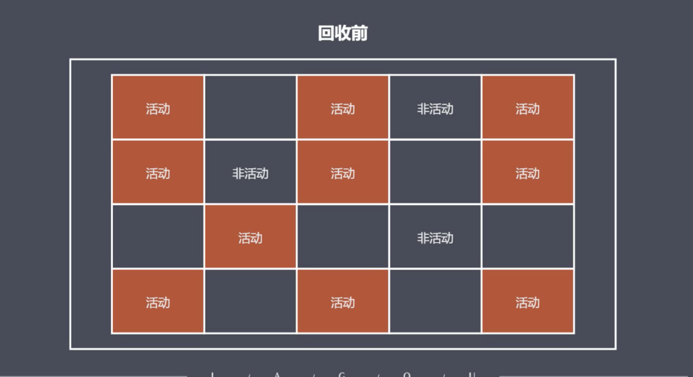
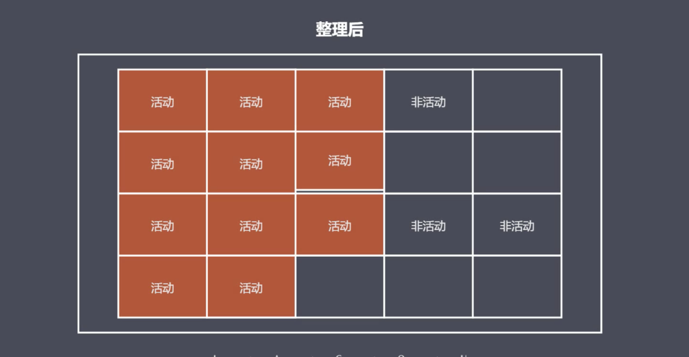
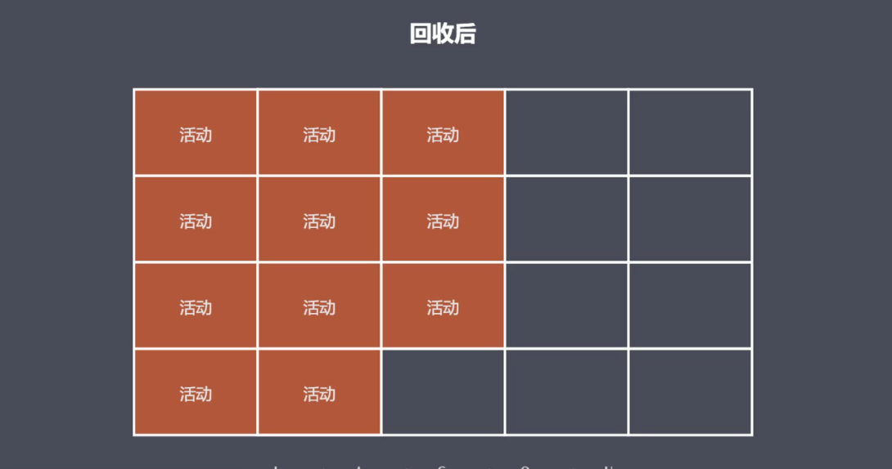
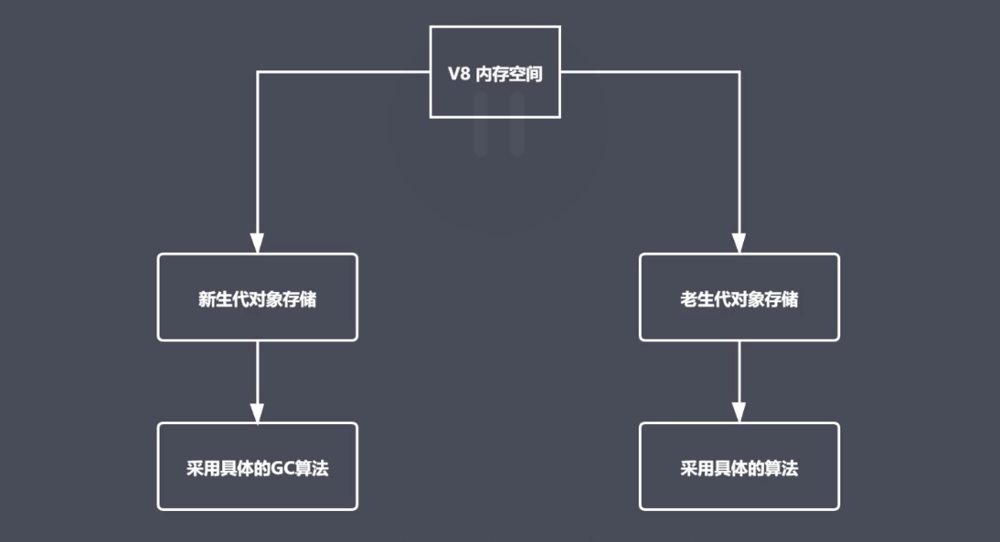
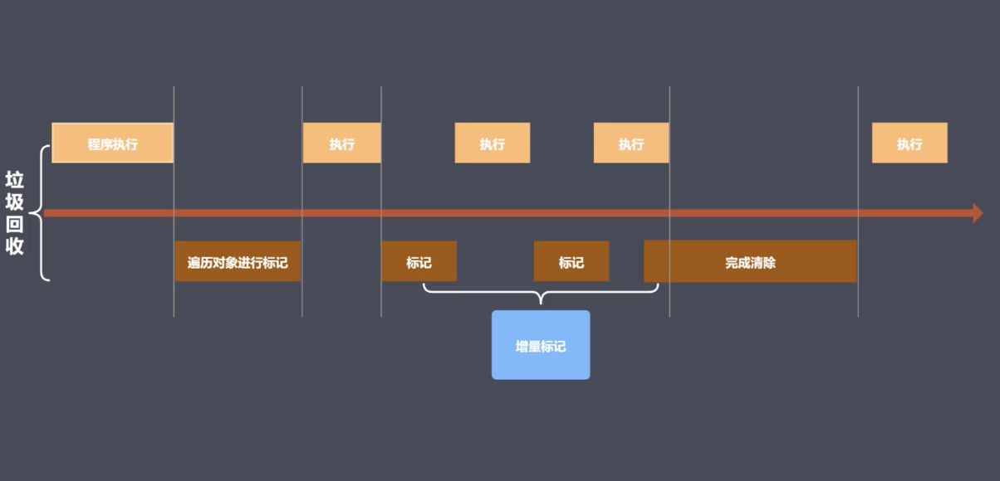

# 性能优化

## 性能优化介绍

- 性能优化是不可避免的
- 哪些内容可以看做是性能优化
- 无处不在的性能优化

## 内存管理

内存为什么需要管理

```js
function fn(){
    arrList = []
    arrList[10000] = 'lg is a coder'
}
fn()
//引起内存泄漏
```



### 内存管理介绍

- 内存：由读写单元组成，表示一片可操作空间
- 管理：人为的去操作一片空间的申请、使用和释放
- 内存管理：开发者主动申请空间、使用空间、释放空间
- 管理流程：申请--使用--释放

### JavaScript中的内存管理

- 申请内存空间
- 使用内存空间
- 释放内存空间

### JavaScript中的垃圾回收

- JavaScript中的内存管理是自动的
- 对象不再引用时就是垃圾
- 对象不能从根上访问到时是垃圾

### JavaScript中的可达对象

- 可以访问到的对象就是可达对象（通过具体的引用，或者当前上下文中的作用域链进行查找）
- 可达的标准就是从根出发是否能够被找到
- JavaScript中的根就可以理解为是全局变量对象（全局执行上下文）

### JavaScript中的引用和可达

```js
//obj 和name都是可达的
let obj = { name: 'xm' }
// obj的引用存+1,存在数值变化
let ali = obj 
// 因为ali对name的引用name属性还是可达的
obj = null

console.log(obj)
console.log(ali)
//null
//{name:'xm'}
```

```js
function objGroup(obj1, obj2) {
    obj1.next = obj2
    obj2.pre = obj1
    return {
        o1: obj1,
        o2: obj2
    }
}
const obj = objGroup({ name: 'obj1' }, { name: 'obj2' })
console.log(obj)

// {
//   o1: <ref *1> {
//     name: 'obj1',
//     next: { name: 'obj2', pre: [Circular *1] }
//   },
//   o2: <ref *2> {
//     name: 'obj2',
//     pre: <ref *1> { name: 'obj1', next: [Circular *2] }
//   }
// }
```


## GC算法

### GC定义与作用

- GC（Garbage Collection）就是垃圾回收机制的简写
- GC可以找到内存中的垃圾、并释放和回收空间，方便代码的后续使用

### GC里的垃圾是什么

- 程序中不再需要使用的对象

```js
function func(){
    name = 'lg'
    return `${name} is a coder`
}
func()
```

- 程序中不能再访问到的对象

```js
function func(){
    const name = 'lg'
    return `${name} is a coder`
}
func()
``` 

### GC算法是什么

- GC是一种机制，垃圾回收器完成具体的回收工作
- 工作的内容就是查找垃圾、释放空间、回收空间
- 算法就是工作时查找和回收所遵循的规则

### 常见GC算法

- 引用计数
- 标记清楚
- 标记整理
- 分代回收

### 引用计数算法

- 核心思想：设置引用数，判断当前引用数是否为0
- 引用计数器
- 引用关系改变时修改引用数字
- 引用数字为0时立即回收

### 引用计数算法的优点

- 发现垃圾时立即回收
- 最大限度减少程序暂停

### 引用计数算法缺点

- 无法回收循环引用的对象
- 时间开销大（要时刻监视着各个对象的引用计数）

```js
//循环引用
function fn(){
    const obj1 = {}
    const obj2 ={}
    // 虽然fn函数中的obj1和obj2是在函数内部声明，但是他们之间存在这循环引用，引用计数算法不能将他们的空间进行回收
    obj1.name = obj2
    obj2.name = obj1
    return 'lg is a coder'
}

fn()
```

### 标记清除算法实现原理

- 核心思想：分标记和清除两个阶段完成
- 遍历所有对象找到并标记所有活动对象（同可达对象），使用递归的方式去查找子节点及子子节点
- 遍历所有对象并清除没有标记的对象，并将去掉之前做的标记，让GC下次还可以正常工作
- 回收相应的空间，交给空闲列表

### 标记清除算法优缺点

- 相对于引用计数来说解决对象操作循环引用的缺点

### 标记清除算法的缺点

- 地址不连续，空间碎片化，回收的垃圾在地址上不连续导致的，不利于空间最大化的使用
- 不会立即回收垃圾对象，而且垃圾回收的时候当前的程序是停止工作的

### 标记整理算法原理

- 标记整理可以看做是标记清除的增强
- 标记阶段的操作和标记清除一致
- 清除阶段会先执行整理，移动对象位置，让回收空间在地址上产生连续





- 减少碎片化空间
- 不会立即回收垃圾

## V8引擎

- V8是一款主流的JavaScript执行引擎（node，chrom）
- V8采用及时编译：之前的引擎是将代码转成字节码，V8是将代码转成可以直接运行的机器码，所以速度会非常快
- V8内存设有上限：64位操作系统上限不超过1.5G，32位操作系统不超过800M，因为V8本身是为浏览器去制造的，现有的内存大小对于网页使用是足够了，V8使用增量标记的算法回收1.5G内存只会消耗50ms，非增量标记的方式回收则需要消耗1s，所以就以1s为界

### V8垃圾回收策略

- 采用分代回收思想
- 内存分为新生代、老生代
- 针对不同对象采用不同算法



### V8如何回收新生代对象


- V8内存空间一分为二
- 小空间用于存储新生代对象（32M|16M）
- 新生代指的是存货时间较短的对象（例如：局部作用域中的变量）

### 新生代对象回收实现

- 回收过程采用复制算法 + 标记整理
- 新生代内存区分为两个等大的空间
- 使用状态是From空间，空闲空间为to状态
- 活动对象存储于From空间，From空间使用到一定程度后会触发GC操作，会进行标记整理，将位置变的连续，保证后续不会产生碎片化的空间
- 标记整理后将活动对象拷贝至To，From空间的对象会在To空间有个备份，所以From空间就可以考虑回收操作，From空间就可以进行空间释放
- From和To交换空间完成释放
  
### 回收细节说明

- 拷贝过程中可能出现晋升，如果某个变量对象所使用的空间在老生代对象里面也会出现，这里就会出现晋升的操作
- 晋升就是将新生代对象移动至老生代进行存储
- 一轮GC还存活的新生代需要晋升至老生代
- To空间的使用率超过25%，也需要将对象都移动至老生代进行存放，因为当To空间达到一定范围后与From进行交换后，新进来的对象所能使用的空间就会不够用。

### V8如何回收老生代对象

- 老年代对象存放在右侧老生代区域
- 64位操作系统有1.4G空间，32位操作系统有700M空间
- 老年代对象是指存活时间较长的对象(全局作用下的变量，还有闭包)

### 老年代回收实现

- 主要采用标记清除、标记整理、增量标记算法
- 首先使用标记清除完成垃圾空间的释放和回收，找到老生代所有的活动对象进行标记，然后释放掉垃圾对象的空间，如此就会存在空间碎片的问题存在，相对于空间碎片来说，它的提升速度还是比较明显的
- 采用标记整理进行空间优化：当新生代的对象往老生代进行移动的时候，而且这个时间节点上老生代的存储空间又不足以存放新生代所移过来的对象这样就会触发标记整理，把之前的碎片空间进行整理回收，就会有更多的空间进行使用
- 采用增量标记进行效率优化

### 细节对比

- 新生代区域垃圾回收使用空间换时间
- 老生代区域回收不适合复制算法

### 标记增量如何优化垃圾回收



>当垃圾回收的时候是会阻塞我们程序执行的
>标记增量就是将一整个的垃圾回收拆分成多个小部分组合的去完成整个回收，从而替代之前一口气做完的垃圾回收操作，主要是实现垃圾回收与程序执行交替进行

>V8引擎使用非增量标记处理最大1.5G的垃圾回收也不会超过1s

## Performance工具使用

## 什么是分离DOM

- 界面元素存在

### 确定频繁的垃圾回收

- Timeline中频繁的上升下降
- 任务管理器中数据频繁的增加减少

### 总结

- Perfromance使用流程
- 内存问题的相关分析
- Performance时序图监控内存变化
- 任务管理器监控内存变化
- 对快照朝招分离DOM

## JavaScript代码优化

### 如何精准测试JavaScript性能

- 使用GitHub账号登录
- 填写个人信息（非必须）
- 填写详细的测试用例信息（title，slug）
- 填写准备代码（DOM操作时经常使用）
- 填写必要有setup和teardown
- 填写测试代码片段

### 慎用全局变量

为什么要慎用？

- 去哪聚变量定义在全局执行上下文，是所有作用域链的最顶端，查找时间消耗比较大
- 全局执行上下文一直存在于上下文执行栈，直到程序退出，这对GC工作是不利的，会降低程序执行过程中对内存的使用
- 如果某个局部作用域出现了同名变量会遮蔽或污染全局

```js
//方法1
var i, str = ''
for (i = 0; i < 1000; i++) {
    str += i
}
//方法2
for (let i = 0; i < 1000; i++) {
    let str = ''
    str += i
}
```

### 缓存全局变量

>将使用中无法避免的全局变量缓存到局部

```js
        function getBtn(){
            let btn1 = document.getElementById('btn1')
            let btn3 = document.getElementById('btn3')
            let btn5 = document.getElementById('btn5')
            let btn7 = document.getElementById('btn7')
            let btn9 = document.getElementById('btn9')
        }
        
        function getBtn2(){
            let obj = document
            let btn1 = obj.getElementById('btn1')
            let btn3 = obj.getElementById('btn3')
            let btn5 = obj.getElementById('btn5')
            let btn7 = obj.getElementById('btn7')
            let btn9 = obj.getElementById('btn9')
        }
```

### 通过原型新增方法

> 在原型对象上新增实例对象需要的方法

```js
// 方式1
var fn1 = function () {
    this.foo = function () {
        console.log(111)
    }
}
let f1 = new fn1()

//方式2--此方式性能较好
var fn2 = function () { }
fn2.prototype.foo = function () {
    console.log(111)
}

let f2 = new fn2()
```

### 避开闭包陷阱

闭包特点

- 外部具有指向内部的引用
- 在外部作用域访问内部作用域的数据

```js
function foo(){
    var name = "lg"
    function fn(){
        console.log(name)
    }
    return fn
}
var a = foo()
a()
```

关于闭包

- 闭包是一种强大的语法
- 闭包使用不当很容易出现内存泄漏
- 不要为了闭包而闭包

```html
<button id="btn1">add</button>
        <script>
        /*内存性能的优化*/
        function foo(){
            /*
             * 1.跨作用于引用
             * 2.突破作用域的限制用到另外一个作用域的数据
             * 
             * 当前内存是泄漏的，因为除了Dom中的引用代码中还存在el的引用，所以GC并不会将el进行回收
             */
            var el = document.getElementById('btn1')
            el.onclick=function(){
                console.log(el.id)
            }
        }
        foo()

        function foo(){
            var el = document.getElementById('btn1')
            el.onclick=function(){
                console.log(el.id)
            }
            // 解决内存的泄漏
            el=null
        }
    </script>
```

### 避免属性访问方法使用

>JavaScript 中的面向对象

- js不需要属性的访问，所有的属性都是外部可见的
- 使用属性访问方法只会增加一层重定义，没有访问的控制力

```js
//方法1
function Person(){
    this.name = "icoder"
    this.age = 18
    this.getAge = function(){
        return this.age
    }
}

const p1 = new Person()
const a = p1.getAge()


//方法2
function Person(){
    this.name = "icoder"
    this.age = 18
}

const p1 = new Person()
const a = p1.age

//方法2性能更好
```

### For循环优化

```html
<button class="btn"></button>
        <button class="btn"></button>
        <button class="btn"></button>
        <button class="btn"></button>
        <button class="btn"></button>
        <button class="btn"></button>
        <button class="btn"></button>
        <button class="btn"></button>
        <button class="btn"></button>
        <button class="btn"></button>
        <button class="btn"></button>
        <script>
        let btns = document.getElementsByClassName("btn")

        for(var i =0;i<btns.length;i++){
            console.log(i)
        }
//第二种方式性能更好，会节省开销
        for(var i =0,len = btns.length;i<len;i++){
            console.log(i)
        }
```

### 采用最优循环方式

```js
//forEach性能最优
let arr = new Array(1, 3, 4, 5, 6)
arr.forEach((item) => {
    console.log(item,'foreach')
})

for (var i = arr.length-1; i>-1; i--) {
    console.log(arr[i],'for')
}

for(let i in arr){
    console.log(arr[i],"in")
}
```

### 节点添加优化

>节点的添加操作必然会有回流和重绘

### 克隆优化节点操作

### 直接量替换Object

## JavaScript性能优化2

### 堆栈中的js执行过程

### 减少判断层级

### 减少作用域链查找层级

### 减少数据读取次数

### 字面量与构造式

### 减少循环体中活动

### 减少声明及语句数

### 惰性函数与性能

### 采用事件委托