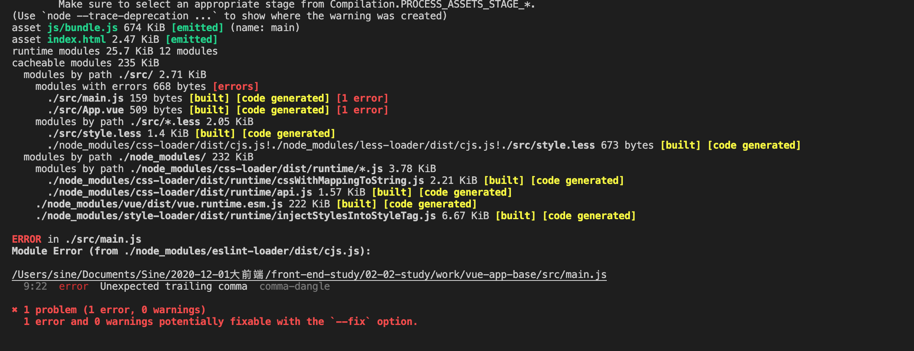
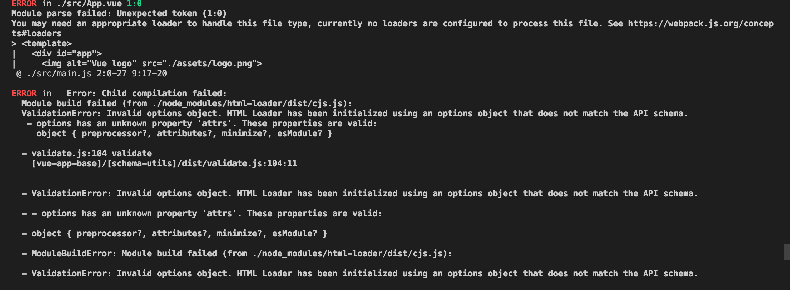
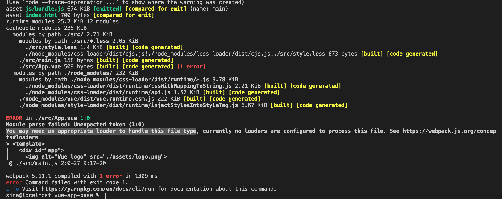
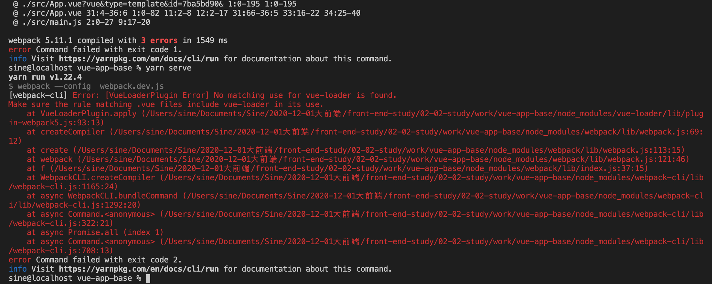
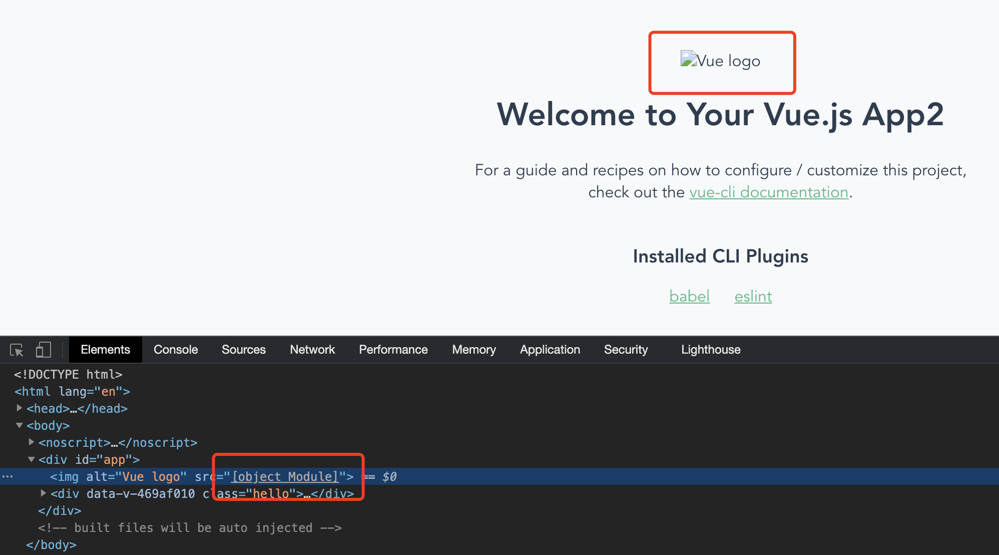
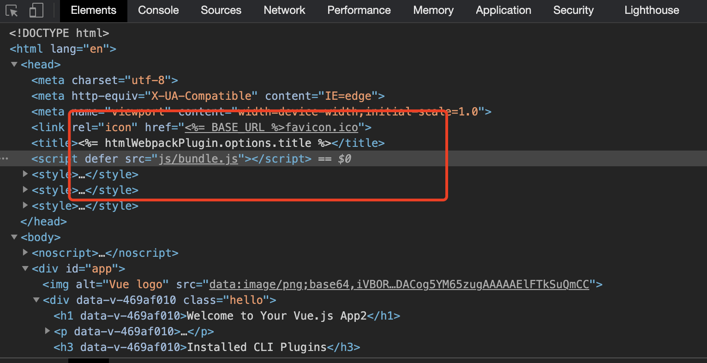
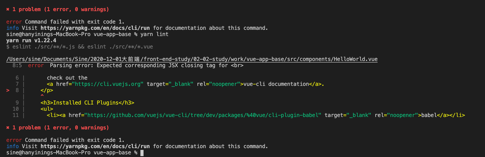

# 作业说明

## 梳理项目，明确要实现的功能

- 初始化webpack
- 使用Webpack Dev Server实现 yarn serve
  - 添加文件资源加载器（3种类型）
  - 生成index.html
  - 添加Dev server(自动编译+自动刷新浏览器)
  - 实现HMR
  - source Map添加
- 使用Webpack实现 yarn build
  - 自动清除输出目录
  - 静态文件拷贝
  - 输出文件名Hash
  - 模块合并
- 使用Webpack实现 yarn lint
  - eslint

## webpack基础信息配置

添加webpack的核心模块

```shell
yarn add webpack webpack-cli --dev
```

> 根据项目中的文件得知项目中有三个webpack的配置文件

添加webpack-merge依赖用来合并webpack配置

```shell
yarn add webpack-merge --dev
```

### webpack.common.js配置

指定webpack的入口文件和输出文件

```js
module.exports = {
  entry: './src/main.js',
  output: {
    filename: 'js/bundle.js'
  },
}

```

### webpack.pro.js配置

mode设置为production

```js
const { merge } = require('webpack-merge')
const common = require('./webpack.common')

module.exports = merge(common, {
  mode: 'production',
})

```

### webpack.dev.js配置

mode设置为development

```js
const { merge } = require('webpack-merge')
const common = require('./webpack.common')

module.exports = merge(common, {
  mode: 'development',
})
```

## 添加Dev server

添加webpack-dev-server依赖

```shell
yarn add webpack-dev-server --dev
```

在package.json中配置scripts，根据项目中的文件分配可知

```js
    "serve": "webpack serve --config  webpack.dev.js",,
    "build": "webpack --config  webpack.prod.js",
```

## 添加资源加载器

### 样式加载器

项目中有less文件所以要使用less-loader，style-loader css-loader是基本的样式加载器

```shell
yarn add less-loader style-loader css-loader --dev
```

在webpack.common中进行配置，ryles按照从后往前的顺序进行执行

```js
  module: {
    rules: [
      {
        test: [/\.less$/,/\.css$/],
        use: [
          "style-loader",
          "css-loader",
          "less-loader"
        ]
      }
    ]
  }
```

执行 yarn serve进行测试发现

```js
Error: Cannot find module 'less'
```

添加less模块

```shell
yarn add less --dev
```

### 文件操作加载器

file-loader加载器用于处理文件资源，将问价资源拷贝的输出目录，然后将文件的访问目录向外导出
url-loader根据代码的需要动态导入资源文件,小文件使用Data URLs，减少请求次数。大文件单独提取存放，提高加载速度
html-loaderloader加载的非JavaScript也会触发资源加载

```shell
yarn add file-loader url-loader html-loader --dev
```

在webpack.common中进行配置
>需要注意的是使用url-loader还是要添加file-loader，超出限制大小的文件会自动加载file-loader
>html-loader默认情况下webpack中只有img的src会触发资源加载，所以要通过arrts来配置触发的属性

```js
  module: {
    rules: [
      {
        test: /\.(png|jpe?g|gif)$/,
        use: {
          loader: 'url-loader',
          options: {
            limit: 100 * 1024 
          }
        }
      },
      {
        test: /.html$/,
        use: {
          loader: 'html-loader',
          options: {
            attrs: ['img:src', 'a:href']
          }
        }
      }
    ]
  }
```

## 生成index.html

添加依赖用于webpack5使用html-webpack-plugin@next
否则会出现
>[DEP_WEBPACK_COMPILATION_ASSETS] DeprecationWarning: Compilation.assets will be frozen in future

```shell
yarn add html-webpack-plugin@next --dev
```

在webpack.common中进行配置，项目中的public文件夹下提供了index.html模板，所以使用模板方式进行配置html信息

```js
const HtmlWebpackPlugins = require("html-webpack-plugin")
module.exports = {
  plugins: [
    new HtmlWebpackPlugins({
      title: 'vue app',//指定index.html的title
      meta: {
        viewport: 'width=device-width',
      },
      template: path.join(__dirname, './public/index.html')
    })
  ]
}
```

## DefinePlugin添加全局常量BASE_URL

```js
const { DefinePlugin } = require("webpack")

module.exports = {
  plugin:[
      new DefinePlugin({
        BASE_URL: JSON.stringify('./')
      }),
  ]
}

```

## 开启HMR

因为HMR仅限在开发模式下使用，所以要对webpack.dev进行配置
需要注意的是要同时配置devServer中的hot为true，还需要再plugins中配置new HotModuleReplacementPlugin()

```js
const { HotModuleReplacementPlugin } = require('webpack')
module.exports = merge(common, {
    mode: 'development',
    devServer: {
        hot: true
    },
    plugins: [
        new HotModuleReplacementPlugin()
    ]
})
```

yarn serve测试更改文件发现，控制台可以重新编译，浏览器没有进行刷新
webpack5 新增的target属性需要添加‘web’属性

```js
const { HotModuleReplacementPlugin } = require('webpack')
module.exports = merge(common, {
    mode: 'development',
    target:'web',
    devServer: {
        hot: true
    },
    plugins: [
        new HotModuleReplacementPlugin()
    ]
})
```

## source Map添加

开发模式也选择eval-cheap-module-source-map

```js
module.exports = merge(common, {
    mode: 'development',
    devtool: 'eval-cheap-module-source-map',
})
```

生产环境就不对source-map进行生成了

## 自动清除输出目录

添加clean-webpack-plugin插件

```shell
yarn add clean-webpack-plugin --dev
```

在webpack.common中进行配置

```js
const CleanWebpackPlugin = require('clean-webpack-plugin')
module.exports = {
  plugins: [
    new CleanWebpackPlugin(),
  ]
}
```

运行 yarn serve发生错误

```js
//clean-webpack-plugin: options.output.path not defined. Plugin disabled...
```

需要在output中添加path: path.resolve(__dirname, 'dist')

```js
const path = require('path')
module.exports = {
  output: {
    filename: 'js/bundle.js',
    path: path.resolve(__dirname, 'dist')
  }
}
```

## 静态文件拷贝

添加依赖copy-webpack-plugin

```shell
yarn add copy-webpack-plugin --dev
```

因为静态文件拷贝只用于生产环境
所以这里实在webpack.pro文件中进行配置

```js
const CopyWebpackPlugin = require('copy-webpack-plugin')
module.exports = merge(common, {
  mode: 'production',
  plugins:[
    //copy-webpack-plugin做了升级要使用patterns进行属性配置
    new CopyWebpackPlugin({
      patterns: [
        {
          from: path.resolve(__dirname, './public/*.ico'),
          to: __dirname + '/dist',
        },
      ],
      options: {}
    }),
  ]
})

```

执行yarn build进行测试发现

```shell
ValidationError: Invalid options object. Copy Plugin has been initialized using an options object that does not match the API schema.
 - options[0] should be an object:
   object { patterns, options? }
```

新版本的copy-webpack-plugin用法为

```js
module.exports = {
  plugins: [
    new CopyWebpackPlugin({
      patterns: [
        { from: "src", to: "dist" },
        { from: "public", to: "dist/public" },
      ],
    }),
  ],
};
```

## 模块合并

## eslint添加及配置

安装eslint

```shell
yarn add eslint --dev
```

初始化esline，生成.eslintrc.js配置文件

```shell
yarn esline --init
// To check syntax, find problems, and enforce code style
//JavaScript modules (import/export)
//Vue.js
```

添加eslint-loader依赖

```shell
yarn add eslint-loader --dev
```

在配置文件中配置eslint-loader,enforce: 'pre'属性表示优先执行

```js
module.exports = {
  module: {
    rules: [
      {
        test: /\.js$/,
        exclude: /node_modules/,
        use: "eslint-loader",
        enforce: 'pre'
      },
    ]
  },
}
```

执行yarn serve后报出的错误


先处理ERROR in ./src/main.js
error  Unexpected trailing comma  comma-dangle，去掉render: h => h(App)后面的","即可

```js
new Vue({
  render: h => h(App)
}).$mount('#app')
```

继续执行


html-loader已经进行升级,具体使用方式如下：

```js
module.exports = {
  module: {
    rules: [
      {
        test: /.html$/,
        use: {
          loader: 'html-loader',
          options: {
            attributes: {
              list: [
                {
                  tag: 'img',
                  attribute: 'data-src',
                  type: 'src',
                },
                {
                  tag: 'a',
                  attribute: 'href',
                  type: 'src',
                },
              ],
            }
          }
        }
      }
    ]
  },
}
```

继续来看出现的问题


添加vue-loader vue-template-compiler并配置，相关资料显示这俩需要一起配置使用

```shell
yarn add vue-loader vue-template-compiler --dev
```

```js
const VueLoaderPlugin = require('vue-loader/lib/plugin')

module.exports = {
  module: {
    rules: [
      {
        test: /\.js$/,
        exclude: /node_modules/,
        use: "eslint-loader",
        enforce: 'pre'
      },
      {
        test: [/\.less$/,/\.css$/],
        use: [
          "style-loader",
          "css-loader",
          "less-loader"
        ]
      },
      {
        test: /\.(png|jpe?g|gif)$/,
        use: {
          loader: 'url-loader',
          options: {
            limit: 100 * 1024
          }
        }
      },
      {
        test: /.html$/,
        use: {
          loader: 'html-loader',
          options: {
            attributes: {
              list: [
                {
                  tag: 'img',
                  attribute: 'data-src',
                  type: 'src',
                },
                {
                  tag: 'a',
                  attribute: 'href',
                  type: 'src',
                },
              ],
            }
          }
        }
      },
       {
        test: /\.vue$/,
        use: 'vue-loader'
      }
    ]
  },
  plugins: [
    //需要注意这里的配置
    new VueLoaderPlugin()
  ]
}
```

继续运行测试


经过多方面查找资料及尝试
找到应该是将vue-loader先去执行

```js
module.exports = {
  entry: './src/main.js',
  output: {
    filename: 'js/bundle.js',
    path: path.resolve(__dirname, 'dist')
  },
  module: {
    rules: [
      {
        test: /\.vue$/,
        loader: 'vue-loader'
      },
      {
        test: /\.js$/,
        exclude: /node_modules/,
        use: "eslint-loader",
        enforce: 'pre'
      },
      {
        test: [/\.less$/,/\.css$/],
        use: [
          "style-loader",
          "css-loader",
          "less-loader"
        ]
      },
      {
        test: /\.(png|jpe?g|gif)$/,
        use: {
          loader: 'url-loader',
          options: {
            limit: 100 * 1024
          }
        }
      },
      {
        test: /.html$/,
        use: {
          loader: 'html-loader',
          options: {
            attributes: {
              list: [
                {
                  tag: 'img',
                  attribute: 'data-src',
                  type: 'src',
                },
                {
                  tag: 'a',
                  attribute: 'href',
                  type: 'src',
                },
              ],
            }
          }
        }
      }
    ]
  },
  plugins: [
    new CleanWebpackPlugin(),
    new HtmlWebpackPlugins({
      title: 'vue app',
      meta: {
        viewport: 'width=device-width',
      },
      template: './public/index.html'
    }),
    new VueLoaderPlugin()
  ]
}
```

继续yarn serve找错误


url-loader版本升级的原因要开启commonJs

```js
      {
        test: /\.(png|jpe?g|gif)$/,
        use: {
          loader: 'url-loader',
          options: {
            limit: 100 * 1024,
            esModule: false
          }
        }
      },
```

yarn serve继续测试



因为项目中没有涉及href加载图片之类的问题，暂时处理方案是去掉html-loader

## stylelint添加

```shell
yarn add stylelint stylelint-config-standard --dev
```

创建.stylelintrc.js文件并初始化内容

```js
module.exports = {
    "extends": "stylelint-config-standard"
}
```

使用yarn stylelint ./src/style.less进行测试
显示错误Unexpected missing end-of-source newline  ，因为暂时没找出这样编写代码的利害，所以先将此属性进行关闭

```js
module.exports = {
    extends: "stylelint-config-standard",
    rules: {
        "no-missing-end-of-source-newline": null,
    }
}
```

## 添加eslint-plugin-vue

>经过测试发现eslint并不会发现vue文件中的错误

```shell
yarn add babel-eslint --dev
```

并在.eslintrc.js进行配置parser: 'babel-eslint',

```js
module.exports = {
  env: {
    browser: true,
    es2021: true
  },
  ///此项是用来指定eslint解析器的，解析器必须符合规则，babel-eslint解析器是对babel解析器的包装使其与ESLint解析
  parser: 'babel-eslint',
  extends: [
    'plugin:vue/essential',
    'standard'
  ],
  parserOptions: {
    ecmaVersion: 12,
    sourceType: 'module'
  },
  plugins: [
    'vue'
  ],
  rules: {
  }
}
```

yarn eslint ./src/**/*.vue发现错误,说明vue文件eslint配置成功



在package.json中配置相应的Script

```js
  "scripts": {
    "serve": "webpack serve --config  webpack.dev.js",
    "build": "webpack --config  webpack.prod.js",
    "lint": "eslint --fix --ext .js,.vue src && yarn lint:style",
    "lint:style": "stylelint ./src/**/*.less"
  },
```