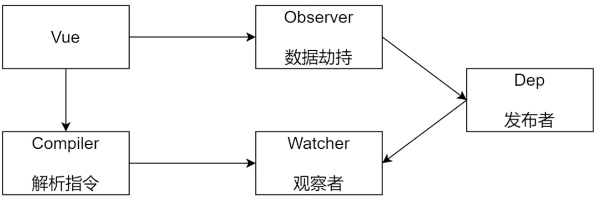

# vue响应式原理

## 课程目标

- 模拟一个最小版本的Vue
- 响应式原理在面试中的常见问题
- 学习别人优秀的经验，转换成自己的经验
- 实际项目中出的问题再原理层面的解决
  - 给Vue实例新增一个成员是否是响应式的？
  - 给属性重新赋值成对象，是否是响应式的？
- 为学习Vue源码做铺垫

## 准备工作

### 数据驱动

数据响应式、双向绑定、数据驱动

- 数据响应式

  > 数据模型仅仅是普通的JavaScript对象，而当我们修改数据是，视图会进行更新，避免了繁琐的DOM操作，提高开发效率

- 双向绑定-
	
	双向绑定包含了数据响应式

	> 数据改变、视图改变；视图改变，数据也随之改变
	> 我们可以使用v-model在表单元素上创建双向数据绑定
	
- 数据驱动是Vue最独特的特性之一
 > 开发过程中仅需要关注数据本身，不需要关心数据是如何渲染到视图

## 数据响应式的核心原理

### Vue2.X

> 当你把一个普通的JavaScript对象传入Vue实例作为data选项，Vue将遍历此对象所有的属性，并使用Object.defineProperty把这些属性全部转为getter/setter。Object.defineProperty是ES5中一个无法shim（被降级）的特性，这就是Vue不支持IE8以及更低版本浏览器的原因。

```html
<div id="app">
    hello
</div>
<script>
  // 模拟 Vue 中的 data 选项
  let data = {
    msg: 'hello'
  }

  // 模拟 Vue 的实例
  let vm = {}

  // 数据劫持：当访问或者设置 vm 中的成员的时候，做一些干预操作
  Object.defineProperty(vm, 'msg', {
    // 可枚举（可遍历）
    enumerable: true,
    // 可配置（可以使用 delete 删除，可以通过 defineProperty 重新定义）
    configurable: true,
    // 当获取值的时候执行
    // 访问器
    get () {
      console.log('get: ', data.msg)
      return data.msg
    },
    // 当设置值的时候执行
    // 设置器
    set (newValue) {
      console.log('set: ', newValue)
      if (newValue === data.msg) {
        return
      }
      data.msg = newValue
      // 数据更改，更新 DOM 的值
      document.querySelector('#app').textContent = data.msg
    }
  })

  // 测试
  vm.msg = 'Hello World'
  console.log(vm.msg)
</script>
```

### Vue3.x

Proxy是直接监听对象，而非属性，不需要循环，是Es6中新增的，IE不支持，由浏览器进行性能优化，比property性能要好。

```html
<div id="app">
    hello
  </div>
  <script>
    // 模拟 Vue 中的 data 选项
    let data = {
      msg: 'hello',
      count: 0
    }

    // 模拟 Vue 实例
    let vm = new Proxy(data, {
      // 执行代理行为的函数
      // 当访问 vm 的成员会执行
      get (target, key) {
        console.log('get, key: ', key, target[key])
        return target[key]
      },
      // 当设置 vm 的成员会执行
      set (target, key, newValue) {
        console.log('set, key: ', key, newValue)
        if (target[key] === newValue) {
          return
        }
        target[key] = newValue
        document.querySelector('#app').textContent = target[key]
      }
    })

    // 测试
    vm.msg = 'Hello World'
    console.log(vm.msg)
  </script>
```

## 发布订阅模式和观察者模式

发布/订阅模式

- 发布/订阅模式

  - 订阅者
  - 发布者
  - 信号中心

  > 假定存在一个信号中心，某个人物执行完成就向信号中心发布（publish）一个信号，其他任务可以向信号中心“订阅”（subscribe）这个信号，从而知道什么时候自己可以开始执行。这就叫做“发布/订阅模式”（publish-subscribe pattern）

- Vue的自定义事件

  ```js
  // Vue 自定义事件
      let vm = new Vue()
      // { 'click': [fn1, fn2], 'change': [fn] }
  
      // 注册事件(订阅消息)
      vm.$on('dataChange', () => {
        console.log('dataChange')
      })
  
      vm.$on('dataChange', () => {
        console.log('dataChange1')
      })
      // 触发事件(发布消息)
      vm.$emit('dataChange')
  ```

### 观察者模式

> Vue响应式中用到的是观察者模式

- 观察者（订阅者）---Watcher
  - 都有一个update（）：当事件发生时，具体要做的事情，更新视图
- 目标（发布者）---Dep
  - subs数组：存储所有的观察者
  - addSub（）：添加观察者
  - notify（）：当事件发生，调用所有观察者的update（）方法
- 与发布/订阅模式的区别是---没有事件中心，只有发布者和订阅者，并且发布者要知道订阅者的存在

### 总结

- 观察者模式是由具体目标调度，比如当事件触发，Dep就会去调用观察者update的方法，所以观察者模式的订阅者与发布者之间是存在依赖的。
- 发布订阅模式由统一调度中心调用，因此发布者和订阅者不需要知道对方的存在。

## 模拟响应式原理

### 整体分析

- vue基本结构

- 打印vue实例观察

- 整体结构

  
  
  > 首先要定义一个Vue的类型，把data中的成员注入到vue实例，转换成getter和setter。
  >
  > vue内部会调用Observer和Complier
  >
  > Observer是进行数据劫持，能够对data中的属性进行监听，如果发生变化会把最新的值发送给Dep（发布者）
  >
  > Complier的作用是解析每个元素中的指令及差值表达式，并替换成相应的数据
  >
  > Watcher是观察者，内部有一个update方法，负责更新视图
  >
  > Dep的作用是添加观察者，当发生变化时通知所有观察者

### Vue

- 功能
  - 负责接收初始化的参数（选项）
  - 负责把data中的属性注入到Vue实例，转换成getter/setter
  - 负责调用Observer监听data中所有属性的变化
  - 负责调用Compiler解析指令及差值表达式
- 结构
  - 类名Vue
  - 属性：记录构造函数中传过来的参数
  	- $options
  	- $el
  	- $data 
  - 方法：约定所有以_开头的都是私有成员
  	- _proxyData() ：把data中的属性转换成getter和setter并注入到vue实例中
  - 代码
  ```js
  class Vue {
  constructor (options) {
    // 1. 通过属性保存选项的数据
    this.$options = options || {}
    this.$data = options.data || {}
    // 如果el是选择器document.querySelector(options.el)，如果是对象直接返回
    this.$el = typeof options.el === 'string' ? document.querySelector(options.el) : options.el
    // 2. 把data中的成员转换成getter和setter，注入到vue实例中
    this._proxyData(this.$data)
    // 3. 调用observer对象，监听数据的变化
    new Observer(this.$data)
    // 4. 调用compiler对象，解析指令和差值表达式
    new Compiler(this)
  }
  _proxyData (data) {
    //把data中的属性转换成getter和setter并注入到vue实例中
    // 遍历data中的所有属性
    Object.keys(data).forEach(key => {
      // 把data的属性注入到vue实例中，this就是vue实例
      Object.defineProperty(this, key, {
        enumerable: true,
        configurable: true,
        get () {
          return data[key]
        },
        set (newValue) {
          if (newValue === data[key]) {
            return
          }
          data[key] = newValue
        }
      })
    })
  }
}
  ```
### Observer

- 功能
	-负责把data选项中的属性转换成响应式数据
  - data中的某个属性也是对象，把该属性转换成响应式数据
  - 数据变化发送通知
- 结构
	
  - 属性名：Observer
  
  - 方法
  	
    - walk:用于遍历data对象中的所有属性，在循环过程中会调用defineReactive
    
    - defineReactive（data,key,value）：定义响应式数据，给属性添加getter和setter

- 代码：

  ```js
  class Observer {
    constructor(data) {
      /*希望通过这个类创建完对象之后，能够立即
      把data中的对象转换成getter和setter，
      所以在constructor中调用walk方法
      */
      this.walk(data)
    }
    walk(data) {
      // 1. 判断data是否是对象，保持代码的健壮性
      if (!data || typeof data !== 'object') {
        return
      }
      // 2. 遍历data对象的所有属性
      Object.keys(data).forEach(key => {
        this.defineReactive(data, key, data[key])
      })
    }
    defineReactive(obj, key, val) {
      let that = this
      // 负责收集依赖，并发送通知
      let dep = new Dep()
      // 如果val是对象，把val内部的属性转换成响应式数据
      this.walk(val)
      Object.defineProperty(obj, key, {
        enumerable: true,
        configurable: true,
        /**
         * obj就是$data,$data中引用了这里的get方法，get又引用了val，这里就触发了闭包，所以val没有被释放掉
         */
        get() {
          // 收集依赖
          Dep.target && dep.addSub(Dep.target)
          //如果这里不传入val而是直接使用data[key]
          //每次调用data[key]就会触发get，就陷入了死递归
          return val
        },
        set(newValue) {
          if (newValue === val) {
            return
          }
          val = newValue
          //新增对象中的属性也转换成getter和setter
          that.walk(newValue)
          // 发送通知
          dep.notify()
        }
      })
    }
  }
  ```

### Compiler

- 功能：操作DOM
	
  - 负责编译模板，解析指令/差值表达式
  
  - 负责页面的首次渲染
  - 当数据变化后重新渲染视图
- 结构
	- 类名Compile
	- 属性
		- el模板
    - vm实例
  - 方法
  	
    - compile(el):遍历el对象的所有节点，如果是文本节点的话解析差值表达式，如果是元素节点的话解析指令
    
    - compileElement(node)
    - compileText(node)
    - isDirective(attrName)
    - isTextNode(node)
    - isElementNode(node)