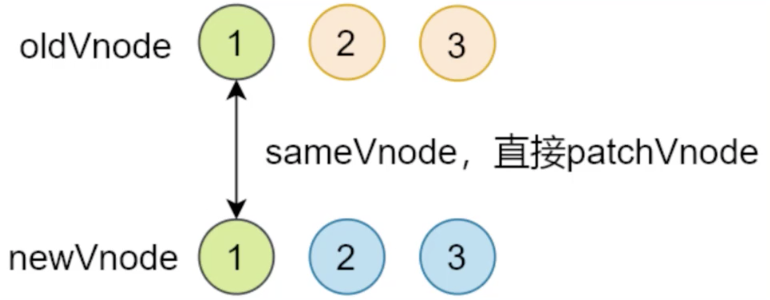
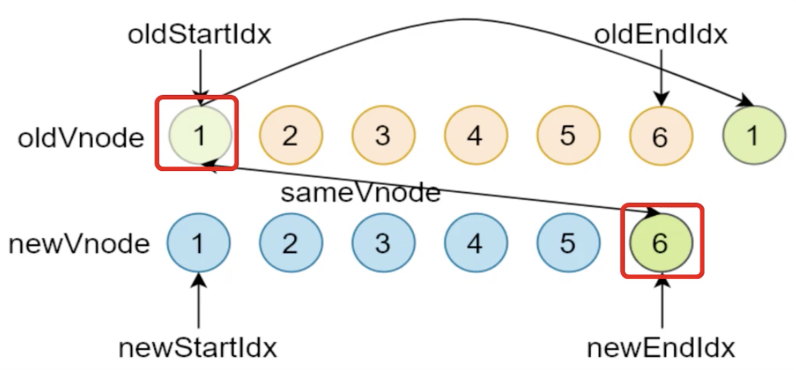
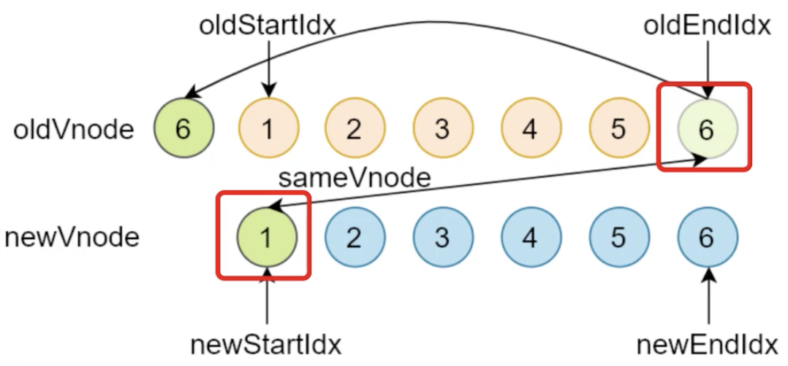
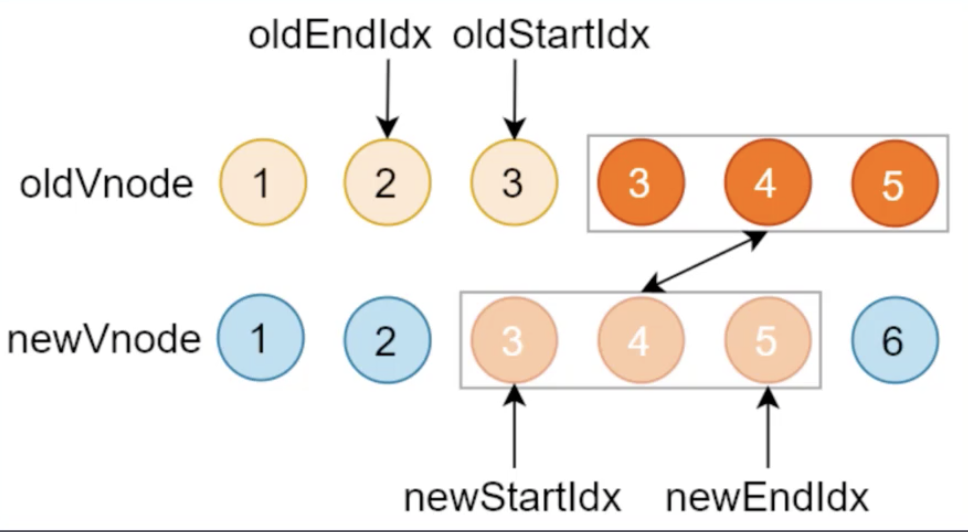
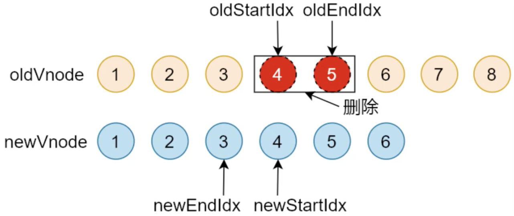

# VirtualDOM实现原理

## 课程目标

- 了解什么是虚拟DOM，以及作用
- Snabbdom的基本使用
- Snabbdom的源码解析

## 什么是虚拟DOM

> 虚拟DOM就是一个JavaScript对象用来描述真实DOM，创建一个虚拟DOM的开销，比创建真实DOM小很多

### 为什么使用虚拟DOM

- 前端开发刀耕火种的时代
- MVVM框架解决视图和状态同步问题
- 模板引擎可以简化视图操作，没法跟踪状态
- 虚拟DOM跟踪状态变化
  - 虚拟DOM可以维护程序的状态，跟踪上一次的状态
  - 通过比较前后两次状态差异更新真实DOM

### 虚拟DOM的作用

- 维护视图和状态的关系
- 复杂视图情况下提升渲染性能--视图比较简单或者首次渲染时虚拟DOM并不能提高性能
- 虚拟DOM最大的好处是跨平台
	- 浏览器平台渲染DOM
	- 服务端渲染SSR（Nuxt.js、Next.js） 	
	- 原生应用（Weex，react Native）
	- 小程序（mpvue、uni-app）等

## snabbdom项目开发

### 步骤

- 安装parcel
- 配置scripts
- 目录结构

### Snabbdom 文档

- 看文档的意义
  - 学习任何一个库都要先看文档
  - 通过文档了解库的作用
  - 看文档中提供的示例，自己快速实现一个demo
  - 通过文档查看API的使用

- init

> init是一个高阶函数，接收一个数组作为参数，数组中加载的是snabbdom的模块，返回一个Patch函数，用来将虚拟DOM转为真实DOM，渲染到界面上

- h

> 用来创建虚拟节点

### 如何学习源码

- 宏观了解
- 带着目标看源码
- 看源码的过程要不求甚解
- 调试
- 参考资料

## Snabbdom源码学习

### h函数

- 作用：创建Vnode
- Vue中的h函数，Vue中的h函数更强大一些，支持组件机制

```js
new Vue({
  router,
  store,
  render:h=>h(App)
}).$mount('#app')
```

- h函数最早见于hyperscript,使用JavaScript创建超文本

### 函数重载

- 参数个数或参数类型不同的函数
- JavaScript中没有重载的概念
- TypeScript中有重载，不过重载的实现还是通过代码调整参数

### VNode

> 用来描述真实DOM

### Patch整体过程分析

- patch(oldVnode,newVnode)
- 把新节点中变化的内容渲染到真实DOM，最后返回新节点最为下一次处理的旧节点
- 对比新旧Vnode是否相同节点（节点的key和sel相同,key是节点的标识，sel是节点的选择器）
- 如果不是相同节点，删除之前的内容，重新渲染
- 如果是相同节点，再判断新的Vnode是否有text,如果有并且和oldVnode的text不同，直接更新文本内容
- 如果新的Vnode有children，判断子节点是否有变化

### init函数

init默认接收两个参数

- modules模块
- domApi作用是将Vnode对象转化成其他平台下的元素，不传入参数时默认的是转换为DOM，虚拟DOM最大的好处是可以跨平台


## Diff算法

就是用来找两个节点之间的差异

虚拟DOM，DOM操作会引起DOM的重拍和重绘，Diff的核心是当数据变化后不直接操作DOM，而是用JS对象来描述真实DOM，当数据变化后先比较JS对象是否发生变化，找出变化后的位置，然后只是最小化的更新变化后的位置，从而提高性能，diff是一种算法。

- 查找两棵树的每一个节点
- 只比较同级别的节点，如果同级别不相同直接删除

### 执行过程

首先对新老数组的开始和结尾设置一个索引，在遍历的过程中移动相应的索引，在对开始和结束节点比较的时候总共有四种情况

- oldStartVnode/newStartVnode(旧开始节点/新开始节点)
- oldEndVnode/newEndVnode(旧结束节点/新结束节点)
- oldStartVnode/newEndVnode(旧开始节点/新结束节点)
- oldEndVnode/newVnode(旧开始节点/新开始节点)

开始和结束节点（新开始节点和旧开始节点、新结束节点和旧结束节点）

- 如果旧开始节点是sameVnode（key和sel相同）

  - 调用patchVnode()对比和更新节点

  - 把旧开始和新开始索引往后移动oldStartIdx++/oldEndIdx++，把后面的节点作为开始节点进行比较

  - 如果新开始节点和旧开始节点不是sameVnode，开始调用patchVnode()比较新结束节点和旧结束节点

  - 如果相同索引往后移动oldStartIdx--/oldEndIdx--，

    > 注意：如果两个节点是sameVnode的话会重用之前的DOM元素，在patchVnode中会对比新旧元素的差异，把差异更新到重用的DOM元素上，这个差异可能是文本内容不同或者子元素不同，这个DOM是不需要重新创建的，如果文本内容或子元素都相同是不会进行DOM操作的，虚拟DOM是通过这种方式提高性能的



- 比较旧开始节点和新结束节点

  - 使用sameVnode比较两个节点是否为相同节点，如果相同调用patchVnode()对比和更新节点
  - 因为oldStartVnode和newEndVnode相同，把oldStartVnode对应的DOM元素，移动到右边，更新索引，旧开始的索引移动到下一个位置，新结束索引往前移动

  

- 旧开始节点和新结束节点

  - 使用sameVnode比较两个节点是否为相同节点，如果相同调用patchVnode()对比和更新节点
  - 因为oldEndVnode和newStartVnode相同，把oldEndVnode移动到最前面更新索引

  

- 非以上四种情况

> 以上情况都不满足说明开始和结束节点都不相同，这个时候在旧节点中一次查找是否有新节点。首先遍历新的开始节点，在旧的数组中查找是否有相同key值的节点，
>
> 没有找到说明新的开始节点是一个新的节点，那表明需要创建DOM元素并把它插入到开始的位置
>
> 如果找到了相同key值的元素，并且sel也相同说明是相同节点，找到的这个旧节点会被赋值到elmTomove这个变量，然后调用patchVnode对比和更新这两个节点内部的差异，然后再把elmToMove节点对应的DOM元素移动到最前面

### 循环结束

- 当老节点的所有子节点先遍历完（oldStarIdx>oldEndIndx），循环结束

  - 说明新节点有剩余，会调用addVnode()把剩余节点批量插入右边，这种情况下旧开始的索引大于旧结束节点的索引

  

- 当新节点的所有子节点先遍历完（newStarIdx>newEndIndx），循环结束

  - 说明老节点有剩余，把剩余节点批量删除，这种情况下新开始索引大于新结束索引

  

