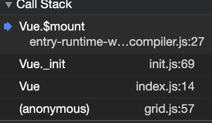

# Vue源码分析

## 响应式原理

- Vue.js的静态成员和实例成员初始化过程
- 首次渲染的过程
- 数据响应式原理

## 准备工作

### Vue源码获取

- 项目地址：https://github.com/vuejs/vue
- 了解Flow
  - /* @flow */ 或//@flow

### 调试设置

#### 打包

- 打包工具Rollup
  - Vue.js源码的打包工具使用的是Rollup，比Webpack轻量
  - Webpack把素有的文件当做模块，Rollup只处理js文件更适合在Vue.js这样的库中使用
  - Rollup打包不会生成冗余的代码
- 安装依赖

```shell
yarn
```

- 设置sourceMap

  - package.json文件中的dev脚本中添加参数--sourcemap

  ```js
  "dev": "rollup -w -c scripts/config.js --sourcemap --environment TARGET:web-full-dev",
  ```

- 执行dev

  - yarn dev 执行打包，用的是rollup，-w参数是监听文件的变化，文件变化自动重新打包
  - -c是设置配置文件，--environment是根据配置的"TARGET:web-full-dev"不同的环境变量生成不同版本的vue

## 首次渲染过程

### Vue的不同的构建版本

- yarn build重新打包所有文件
- [官方解释](https://cn.vuejs.org/v2/guide/installation.html#%E5%AF%B9%E4%B8%8D%E5%90%8C%E6%9E%84%E5%BB%BA%E7%89%88%E6%9C%AC%E7%9A%84%E8%A7%A3%E9%87%8A)


|  | UMD | CommonJS |ES Moudle|
| :-----| :---- | :---- | ------ |
| 完整版 | vue.js | vue.js |vue.js|
| 运行时版本 | vue.runtime.js | vue.runtime.common.js |vue.runtime.esm.js|
| 完整版 | vue.min.js |--|--|
| 运行时版本(生产环境) | vue.runtime.js |--|--|

术语

- 完整版：同时包含编译器和运行时版本
- 编译器：用来将模板字符串编译成为JavaScript渲染函数(render函数)的代码，体积大、效率低
- 运行时：用来创建Vue实例，渲染并处理虚拟DOM等的代码，体积小，效率高。基本上就是除去编译器的代码。少了3000多行代码。
- UMD：通用的模块版本，支持多种模块方式，vue.js默认文件就是运行时+编译器的UMD版本
- CommonJS(cjs):CommonJS版本用来配合老的打包工具比如：Browserify和webpack 1
- ESModule（标准）：从2.6开始Vue会提供两个ES Modules（ESM）构建文件，为现代打包工具提供的版本
  - ESM格式被设计为可被静态分析（编译的时候去解析），所以打包工具可以利用这一点来进行tree-shaking，并将用不到的代码排除出最终的包。
  - ES6模块与CommonJS模块的差异

### 寻找入口文件

```js
"dev": "rollup -w -c scripts/config.js  --sourcemap --environment TARGET:web-full-dev",
```

- scripts/config.js执行过程

  - 作用：生成rollup构建的配置文件

  - 使用环境变量TARGET:web-full-dev web版本下的不压缩（full）开发模式（dev）

    ```js
    /**
     * 判断环境变量是否存在TARGET
     * 如果存在，使用genConfig生成rollup配置文件
     */
    
    if (process.env.TARGET) {
      module.exports = genConfig(process.env.TARGET)
    } else {
      //否则获取全部配置
      exports.getBuild = genConfig
      exports.getAllBuilds = () => Object.keys(builds).map(genConfig)
    }
    
    ```
  看源码的时候要给自己设定个目标

  

### 从入口文件开始

vue/src/platforms/web/entry-runtime-with-compiler.js

#### 通过查看源码解决下面问题

- 观察以下代码，通过阅读源码，回答在页面上输出的结果

```js
const vm = new Vue({
  el:'#app',
  template:'<h3>123</>'
  render: h => h(App)
})
```

- el不能是body或者html
- 如果有render则执行render，没有render会去编译template模板，
- 

Vue使用的是构造函数

###  四个导出Vue的模块-初始化过程-首次渲染过程

- src/core/instance/index.js，与实例相关----挂载动态成员
  
  - 与平台无关
  - 定义了Vue构造函数，调用了this._init(options)方法
  - 给Vue中混入了常用的实例成员，在原型上挂载了很多成员
    - 调用了initMixin(Vue)，添加init()方法
    - stateMinxin（Vue），添加了$data/$props/$set/$delete/$watch，仅仅初始化了$data/$props的属性，没有进行赋值
    - eventsMixin(Vue)，初始化事件相关方法$on/$once/$off/$emit
    - lifecycleMixin(Vue)，初始化了生命周期相关的信息，其中_update中调用了patch（）把虚拟DOM转化成真实DOM
    - renderMixin（），增加了_render函数，用来执行用户传入的render或者把模板转换为render函数
  
- src/core/index.js----挂载静态成员

  - 与平台无关
  - 调用initGlobalAPI给Vue挂载静态方法

  ```js
   // 初始化 Vue.config 对象
    Object.defineProperty(Vue, 'config', configDef)
  // 这些工具方法不视作全局API的一部分，除非你已经意识到某些风险，否则不要去依赖他们
    Vue.util = {
      warn,
      extend,
      mergeOptions,
      defineReactive
    }
    // 静态方法 set/delete/nextTick
    Vue.set = set
    Vue.delete = del
    Vue.nextTick = nextTick
  
    // 2.6 explicit observable API
    // 让一个对象可响应
    Vue.observable = <T>(obj: T): T => {
      observe(obj)
      return obj
    }
    // 初始化 Vue.options 对象，并给其扩展
    // components/directives/filters
    Vue.options = Object.create(null)
    ASSET_TYPES.forEach(type => {
      Vue.options[type + 's'] = Object.create(null)
    })
  
    // this is used to identify the "base" constructor to extend all plain-object
    // components with in Weex's multi-instance scenarios.
  //存储了Vue构造函数
    Vue.options._base = Vue
  
    // 设置 keep-alive 组件
    extend(Vue.options.components, builtInComponents)
  
    // 注册 Vue.use() 用来注册插件
    initUse(Vue)
    // 注册 Vue.mixin() 实现混入
    initMixin(Vue)
    // 注册 Vue.extend() 基于传入的options返回一个组件的构造函数
    initExtend(Vue)
    // 注册 Vue.directive()、 Vue.component()、Vue.filter()
    initAssetRegisters(Vue)
  ```

- src/platforms/web/runtime/index.js

  - web平台相关
  - 注册平台相关的全局指令：v-model/v-show
  - 注册平台相关的全局组件：v-transition/v-transition-group
  - 全局方法：
    - Vue.prototype.____patch____函数，将虚拟DOM转为真实DOM
    - 定义了Vue.prototype.$mount，用来挂载方法。在这个方法中首先会重新获取el，因为运行时是不会进入entry-runtime-with-compiler.js这个入口的，所以这里的$mount要获取一下el，调用mountComponent()

- src/core/instance/lifecycle.js中定义了mountComponent()

  - 如果此时使用的是运行时，判断是否有render选项，如果没有但是传入了template（模板），且当前是开发环境会发送警告，告诉我们运行时不支持编译器
  - 触发beforeMount钩子函数
  - 定义updateComponent
    - 定义了vm._update(vm._render(), hydrating)
    - vm._render()渲染，渲染虚拟DOM
    - vm._update更新，将虚拟DOM转换成真实DOM，并且挂载到页面
  - 创建Watcher实例
    - 传递了updateComponent
    - 调用Watcher的get方法
      - 创建完Watcher会调用一次get，就会往Dep的栈中添加一个watcher
      - 调用updateComponent()
      - 调用vm.render()创建Vnode
        - 调用render.call(cm._renderProxy,vm.$createElment)
        - 调用实例化时Vue传入的render（）
        - 或者编译template生成的render()
        - 返回Vnode
      - 调用wm._update(vnode)
        - 调用vm.____patch___(vm.$el,vnode)挂载真实DOM
        - 记录vm.$el
  - 触发钩子函数mounted，挂载结束。callHook(vm, 'mounted')
  - 返回vue实例 return vm

- vue/src/platforms/web/entry-runtime-with-compiler.js，增加了编译功能

  - web平台相关的入口
  - 重写了平台相关的$mount方法，增加了编译能力，通过compileToFounction()将template模板转为render函数，然后将render函数存到options.render中
  - 注册了Vue.compile()方法，手动将模板转换为render函数，传递一个HTML字符串返回render函数

  

  

  

  ### 首次渲染过程

  src/core/instance/index.js文件中的this._init()

  - Vue中Watch一共有三种
    - 渲染的
    - 计算属性的
    - 侦听器

## 数据响应原理

### 通过查看源码解决下面问题

- vm.msg = { count: 0 } ，重新给属性赋值，是否是响应式的? 
- vm.arr[0] = 4 ，给数组元素赋值，视图是否会更新 
- vm.arr.length = 0 ，修改数组的 length，视图是否会更新 
- vm.arr.push(4) ，视图是否会更新

### 响应式处理的入口

- src\core\instance\init.js

  initState(vm) vm 状态的初始化 ，初始化了vue实例的状态

  初始化了 _data、_props、methods 等

- src\core\instance\state.js

```js
// 数据的初始化
if (opts.data) {
  //注入了实例，并且把它装换成响应式对象，里面调用了observe
  initData(vm)
} else {
  observe(vm._data = {}, true /* asRootData */)
}
```

- initData(vm) vm 数据的初始化

```js
function initData (vm: Component) {
  let data = vm.$options.data
  // 初始化 _data，组件中 data 是函数，调用函数返回结果 
  // 否则直接返回 data
  data = vm._data = typeof data === 'function'
      ? getData(data, vm)
  : data || {} ......
  // proxy data on instance
  // 获取 data 中的所有属性
  const keys = Object.keys(data) // 获取 props / methods
  const props = vm.$options.props
  const methods = vm.$options.methods
  let i = keys.length
  // 判断 data 上的成员是否和 props/methods 重名 ......
  // observe data
  // 数据的响应式处理
  observe(data, true /* asRootData */)
}
```

- src\core\observer\index.js

  ```js
  export function observe (value: any, asRootData: ?boolean): Observer | void
  {
      // 判断 value 是否是对象
      if (!isObject(value) || value instanceof VNode) {
      return
  }
  let ob: Observer | void
  // 如果 value 有 __ob__(observer对象) 属性 结束
  if (hasOwn(value, '__ob__') && value.__ob__ instanceof Observer) {
      ob = value.__ob__
    } else if (
      shouldObserve &&
      !isServerRendering() &&
      (Array.isArray(value) || isPlainObject(value)) &&
      Object.isExtensible(value) &&
      !value._isVue
  ){
    // 创建一个 Observer 对像
      ob = new Observer(value)
      }
      if (asRootData && ob) {
        ob.vmCount++
      }
      return ob 
  }    
  ```

- src\core\observer\index.js

  > Observer类用于收集依赖和派发更新
  
  - 对对象做响应化处理
  - 对数组做响应化处理
  - walk(obj)
     遍历 obj 的所有属性，为每一个属性调用 defineReactive() 方法，设置 getter/setter

### **defineReactive()**

- src\core\observer\index.js
   defineReactive(obj, key, val, customSetter, shallow)
  - 为一个对象定义一个响应式的属性，每一个属性对应一个 dep 对象 
  - 如果该属性的值是对象，继续调用 observe 
  - 如果给属性赋新值，继续调用 observe
  - 如果数据更新发送通知

**Dep** **类**

src\core\observer\dep.js

- 依赖对象
- 记录 watcher 对象
- depend() -- watcher 记录对应的 dep 发布通知

调试

- 收集依赖的过程，就是通过msg属性对应的dep对象，收集组件对应的watcher添加到msg对应的subs数组中来，msg调用了两次，添加依赖只需要添加一次，只要msg发生变化，就去通知对应的watcher对象就会通知更新视图

- 首先是在mountComponent属性中创建的watcher对象的位置创建断点，因为收集依赖是在watcher的get方法中完成的，mountComponent在src/core/instance/lifecycle.js文件中，这样每一个组件都会创建一个watcher
- 在创建watcher之前创建一个updateComponent，在这里面完成将虚拟DOM转换成真实DOM
- 在创建Watcher时将updateComponent传递过来，在get方法中会调用updateComponent

### 数组

把会改变原有数组元素的方法，进行重新的修补，当这些方法被调用的时候，会触发dep.notify()方法

修改数组索引时没有触发dep.notify()所以不会更新视图

Watcher类

- Watcher分为三种，Computed Watcher（计算属性）、用户Watcher（侦听器）、渲染Watcher。前两种watcher都是在init阶段创建
- 渲染Watcher的创建时机
src/core/instance/lifecycle.js

在mountComponent进行创建

```js
updateComponent = () => {
  vm._update(vm._render(), hydrating)
}  
new Watcher(vm, updateComponent, noop, {
    before () {
      if (vm._isMounted && !vm._isDestroyed) {
        callHook(vm, 'beforeUpdate')
      }
    }
  }, true /* isRenderWatcher */)
  
```
src/core/observer/dep.js
```js
// Dep.target 用来存放目前正在使用的watcher
// 全局唯一，并且一次也只能有一个watcher被使用
// The current target watcher being evaluated.
// This is globally unique because only one watcher
// can be evaluated at a time.
Dep.target = null
const targetStack = []
// 入栈并将当前 watcher 赋值给 Dep.target
// 父子组件嵌套的时候先把父组件对应的 watcher 入栈，
// 再去处理子组件的 watcher，子组件的处理完毕后，再把父组件对应的 watcher 出栈，继续操作
export function pushTarget (target: ?Watcher) {
  targetStack.push(target)
  Dep.target = target
}

export function popTarget () {
  // 出栈操作
  targetStack.pop()
  Dep.target = targetStack[targetStack.length - 1]
}
```

### 动态添加响应式属性

Vue.set、vm.$set

